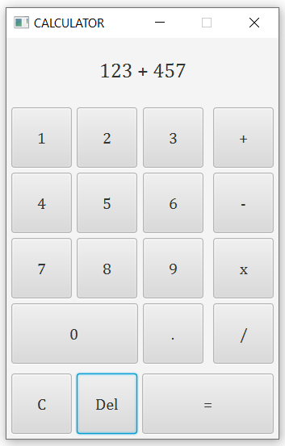

## Problem1 output

## Problem2 output
### The calculator has limited functions:
- It only processes the first two operands, even if there are more.
- After every operation the screen is not cleared automatically, you should press clear button (C).

